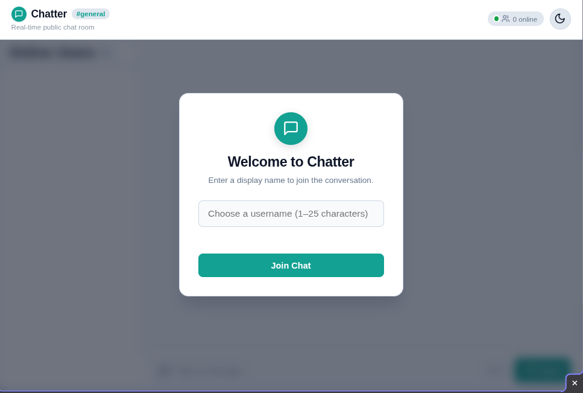

# Chatter

Chatter is a lightweight, responsive real-time web chat application engineered with Node.js, Express, Socket.IO, and Vanilla HTML/CSS/JavaScript. It demonstrates how to build resilient, bidirectional communication architectures with sub-50ms message propagation, live presence tracking, debounced typing feedback, and adaptive dual-theming—completely free of client-side bundlers, transpilers, or frontend framework overhead.

---

## Demo & Screenshots



---

## Key Features

- **Instantaneous Messaging & History**: Sub-50ms bidirectional message distribution via WebSockets with HTTP long-polling fallback. Newly connected clients instantly receive the last 50 messages from the in-memory circular buffer.
- **Consecutive Message Grouping & Timestamps**: Messages sent by the same user within 120 seconds automatically collapse redundant avatars and header metadata into clean, grouped bubbles with localized timestamp tooltips.
- **Live Presence & Duplicate Protection**: Real-time user roster updates on join and departure with active user count badges and inline system notices. Enforces case-insensitive duplicate username rejection.
- **Debounced Typing Activity Engine**: Broadcasts peer typing activity with a 3,000ms inactivity debounce timer, sender broadcast exclusion, defensive 4,000ms safety auto-dismissal, and natural pluralization (`Alice is typing...`, `Alice and Bob are typing...`, `Several people are typing...`).
- **Dual-Theme Engine (Dark / Light)**: Instant atomic theme switching powered by CSS Custom Properties on `[data-theme]`, contrast-validated HSL teal accents (`hsl(174, 80%, 50%)` dark, `hsl(174, 80%, 35%)` light), `localStorage` persistence, and OS `prefers-color-scheme` synchronization.
- **Mobile-First Responsive Layout**: Smooth transition from a swipeable off-canvas slide-out navigation drawer with backdrop overlay on mobile (≤768px) to a persistent side-by-side layout on desktop (>768px), optimized with `100dvh` to prevent virtual keyboard clipping.
- **Network Resilience & Auto-Rejoin**: Automatic connection lifecycle tracking (`connect`, `disconnect`, `reconnecting`, `reconnect`) with visual status telemetry banners, input form locks, and automated re-join handshakes using cached credentials.
- **Interactive Polish & Accessibility**: Crisp Lucide inline SVG iconography, zero-dependency inline emoji quick-picker with caret-preserving text insertion, live 500-character input counter with warning/danger thresholds, and full WAI-ARIA landmark support with strict XSS prevention (`textContent` DOM binding).

---

## Tech Stack

| Layer | Technology | Version | Purpose |
|---|---|---|---|
| **Runtime** | [Node.js](https://nodejs.org/) | `>=18.0.0` | Server JavaScript execution environment |
| **Backend Server** | [Express](https://expressjs.com/) | `^4.19.2` | Static file hosting and test endpoint routing |
| **Real-Time Transport** | [Socket.IO](https://socket.io/) | `^4.7.5` | Bidirectional WebSocket communication & fallback |
| **Frontend Architecture** | Vanilla HTML5 / CSS3 / ES6+ | Native | Zero-build modular client via `window.Chatter` |
| **Iconography** | [Lucide Icons](https://lucide.dev/) | Vector SVG | Inline SVGs with dynamic `currentColor` styling |
| **Test Runner** | Node.js Test Runner (`node:test`) | Native | Unit, store, and socket integration tests |
| **E2E Testing** | [Playwright](https://playwright.dev/) | `^1.62.1` | Multi-browser end-to-end automated testing |
| **Package Manager** | [pnpm](https://pnpm.io/) | `>=8.0.0` | Fast, deterministic dependency management |

---

## Prerequisites

Before running Chatter, ensure you have the following installed on your machine:

- **Node.js**: `v18.0.0` or higher ([Download Node.js](https://nodejs.org/))
- **pnpm**: `v8.0.0` or higher (`npm install -g pnpm`)

---

## Installation

Clone the repository and install project dependencies using `pnpm`:

```bash
# Clone the repository
git clone https://github.com/Gito125/chatter.git
cd chatter

# Install dependencies (strictly use pnpm)
pnpm install
```

---

## Usage

### Start the Production Server

```bash
pnpm start
```

### Start the Development Server (with Auto-Reload)

```bash
pnpm dev
```

Once started, open your browser and navigate to:
```
http://localhost:3000
```

> **Tip**: Open two separate browser windows (or an incognito window) at `http://localhost:3000` to test bidirectional messaging, typing indicators, and presence synchronization between different users.

---

## Running Tests

Chatter includes a comprehensive testing suite comprising unit tests, data access layer assertions, socket lifecycle checks, rubric structural gates, and full Playwright browser end-to-end specs.

### Unit, Store & Socket Integration Tests

Runs all 72 automated unit, data store, and Socket.IO protocol integration tests using the native Node.js test runner:

```bash
pnpm test
```

### End-to-End Browser Tests (Playwright)

Executes all 48 Playwright end-to-end browser specifications (testing presence, message streams, typing debouncers, dual-theme switching, mobile drawer navigation, network resilience, and input polish):

```bash
pnpm exec playwright test
```

To run Playwright tests in interactive UI mode:

```bash
pnpm exec playwright test --ui
```

---

## Project Structure

```
Chatter/
├── docs/                        # Architecture & technical specifications
│   ├── 01-mini-vision.md        # Vision statement & core requirements
│   ├── 02-mini-prd.md           # Product requirements & user stories
│   ├── 03-mini-srs.md           # System requirements specification
│   ├── 04-socket-events.md      # Socket event contracts & schemas
│   ├── 05-folder-structure.md   # Directory layout rationale
│   ├── 06-adr-tech-decisions.md # Architecture decision records
│   └── ARCHITECTURE.md          # Comprehensive system & data flow guide
├── e2e/                         # Playwright end-to-end browser test suites
│   ├── mobile.spec.js           # Mobile drawer & responsive viewport tests
│   ├── polish.spec.js           # Lucide icons, emoji picker & counter tests
│   ├── presence.spec.js         # Online user roster & presence tests
│   ├── resilience.spec.js       # Disconnect, reconnect & duplicate name tests
│   ├── stream.spec.js           # Grouping, timestamps & smart scroll tests
│   ├── theme.spec.js            # Theme toggle, persistence & OS sync tests
│   └── typing.spec.js           # Debounced typing indicator tests
├── public/                      # Static client assets (served by Express)
│   ├── css/
│   │   └── styles.css           # Design tokens, themes & mobile-first styles
│   ├── js/
│   │   ├── app.js               # Application orchestrator & DOM event wiring
│   │   ├── emoji.js             # Caret-preserving inline emoji picker module
│   │   ├── socket.js            # Socket.IO client interface & lifecycle manager
│   │   ├── theme.js             # Theme manager (localStorage & matchMedia)
│   │   └── ui.js                # Safe DOM rendering & UI state controller
│   └── index.html               # Semantic HTML5 shell & accessible modals
├── src/                         # Server-side backend codebase
│   ├── server.js                # Express static server & Socket.IO bootstrapper
│   ├── socket/
│   │   ├── events.js            # Domain:action event name constants
│   │   └── handlers.js          # Socket event listeners, validators & broadcasts
│   └── store/
│       └── memory.js            # In-memory Data Access Layer (DAL) abstraction
├── test/                        # Backend unit & integration test suites
│   ├── rubric.test.js           # Structural contract & zero-hardcoded-color checks
│   ├── socket.test.js           # Real Socket.IO client-server integration tests
│   └── store.test.js            # Memory store validation & buffer cap tests
├── AGENTS.md                    # Coding conventions & project rules for AI agents
├── package.json                 # Project dependencies and script definitions
├── playwright.config.js         # Playwright test suite runner configuration
├── pnpm-lock.yaml               # Locked dependency tree
└── README.md                    # Project documentation
```

---

## Socket Event Contract Matrix

All WebSocket communication uses strict `domain:action` event identifiers defined in [`src/socket/events.js`](file:///home/gideon/Documents/CODE/Projects/Chatter/src/socket/events.js):

| Constant | Event Name | Direction | Payload Schema | Description |
|---|---|---|---|---|
| `USER_JOIN` | `user:join` | Client ➔ Server | `{ username: string }` | Client requests to register username and join the room |
| `MESSAGE_SEND` | `message:send` | Client ➔ Server | `{ text: string }` | Client submits a chat message (1–500 chars) |
| `USER_TYPING` | `user:typing` | Client ➔ Server | `{ isTyping: boolean }` | Client notifies server of active typing state |
| `USERS_LIST` | `users:list` | Server ➔ Sender | `{ users: User[] }` | Initial snapshot of online users sent to joining client |
| `MESSAGE_HISTORY` | `message:history` | Server ➔ Sender | `{ messages: Message[] }` | Buffer of recent messages (max 50) sent to joining client |
| `USER_JOINED` | `user:joined` | Server ➔ Broadcast | `{ username: string, users: User[] }` | Broadcasts user arrival and updated active roster |
| `USER_LEFT` | `user:left` | Server ➔ Broadcast | `{ username: string, users: User[] }` | Broadcasts user departure and updated active roster |
| `MESSAGE_RECEIVE` | `message:receive` | Server ➔ Broadcast | `{ id, username, text, timestamp }` | Broadcasts validated message to all connected clients |
| `USER_TYPING_UPDATE` | `user:typing` | Server ➔ Broadcast Excl. Sender | `{ username: string, isTyping: boolean }` | Relays peer typing indicator to other room participants |

---

## Security & Architecture Highlights

1. **XSS Immunity**: Zero `innerHTML` injection of untrusted user input. All user-generated text is rendered strictly using `textContent` and safe DOM attribute bindings.
2. **Data Access Layer (DAL)**: Handlers in `src/socket/handlers.js` never manipulate collections directly; all storage operations route through `src/store/memory.js`, ensuring zero business logic modification when migrating to PostgreSQL.
3. **Zero-Build Modular Client**: Clean Separation of Concerns (SoC) using native browser scripts orchestrated via the `window.Chatter` namespace.
4. **Zero Hardcoded CSS Colors**: 100% of color styling relies on CSS Custom Properties defined on `[data-theme]`.

---

## License

This project is licensed under the [MIT License](file:///home/gideon/Documents/CODE/Projects/Chatter/LICENSE).
