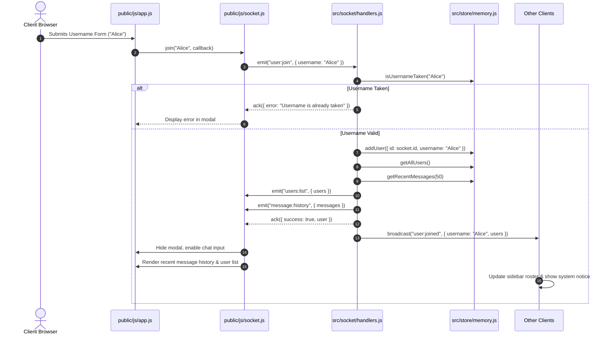

# Chatter — System Architecture & Design Guide

This document outlines the software architecture, data flow lifecycles, technical decisions, and extension guidelines for **Chatter**.

---

## 1. High-Level System Architecture

Chatter is engineered around a clean **Separation of Concerns (SoC)** spanning a layered Node.js backend and an unbundled modular frontend orchestrated through the `window.Chatter` namespace.

```
+-----------------------------------------------------------------------------------------+
|                                    BROWSER CLIENT                                       |
|                                                                                         |
|  +---------------------+  +--------------------+  +--------------------+  +----------+  |
|  | public/js/theme.js  |  | public/js/emoji.js |  |  public/js/ui.js   |  | CSS      |  |
|  | - localStorage      |  | - 40 Emoji Palette |  | - Safe DOM (XSS)   |  | Tokens   |  |
|  | - matchMedia sync   |  | - Caret Insertion  |  | - Message Grouping |  | [data-   |  |
|  | - Theme Switcher    |  | - Popover Lifecycle|  | - Smart AutoScroll|  |  theme]  |  |
|  +----------+----------+  +---------+----------+  +---------+----------+  +----+-----+  |
|             |                       |                       |                  |        |
|             +-----------------------+-----------------------+------------------+        |
|                                     |                                                   |
|                        +------------v------------+                                      |
|                        |   public/js/socket.js   |                                      |
|                        | - Socket.IO Client      |                                      |
|                        | - Lifecycle Listeners   |                                      |
|                        | - Auto-Rejoin Handshake |                                      |
|                        +------------+------------+                                      |
|                                     |                                                   |
|                        +------------v------------+                                      |
|                        |    public/js/app.js     |                                      |
|                        | - Bootstrap & Init      |                                      |
|                        | - 3s Typing Debouncer   |                                      |
|                        | - Event Coordination    |                                      |
|                        +------------+------------+                                      |
+-------------------------------------|---------------------------------------------------+
                                      | WebSocket (HTTP Long-Polling Fallback)
+-------------------------------------|---------------------------------------------------+
|                                     |                                                   |
|                          NODE.JS / EXPRESS BACKEND                                      |
|                                     |                                                   |
|  +----------------------------------v------------------------------------------------+  |
|  | src/server.js                                                                     |  |
|  | - Express Static Hosting (`public/`)                                              |  |
|  | - HTTP Server & Socket.IO Initialization                                           |  |
|  | - Test Isolation Endpoints (`/api/test/reset`)                                    |  |
|  +----------------------------------+------------------------------------------------+  |
|                                     |                                                   |
|  +----------------------------------v------------------------------------------------+  |
|  | src/socket/handlers.js                                                            |  |
|  | - Incoming Connection & Event Routing                                            |  |
|  | - Payload Validation & Sanitization                                               |  |
|  | -                           |  |
|  +----------------------------------+------------------------------------------------+  |
|                                     |                                                   |
|  +----------------------------------v------------------------------------------------+  |
|  | src/store/memory.js (Data Access Layer Abstraction)                               |  |
|  | - Encapsulated Users `Map` & Messages Circular Buffer Array                       |  |
|  | - Methods: addUser, getUser, removeUser, getAllUsers, isUsernameTaken             |  |
|  | - Methods: saveMessage, getRecentMessages, clearStore                             |  |
|  +-----------------------------------------------------------------------------------+  |
+-----------------------------------------------------------------------------------------+
```

---

## 2. Core Subsystems & Responsibilities

### 2.1 Backend Modules (`src/`)

- **`src/server.js`**: Minimal HTTP server entrypoint. Configures Express static file serving from `public/`, sets up test reset hooks, attaches the Socket.IO server instance, and delegates real-time event handling.
- **`src/socket/events.js`**: Single source of truth for all WebSocket event identifiers. Uses an immutable `EVENTS` catalog following the `domain:action` convention to prevent typo bugs.
- **`src/socket/handlers.js`**: Implements WebSocket business logic. Validates inbound payloads, coordinates room broadcasts and sender exclusions, tracks client disconnections, and interacts exclusively with the Data Access Layer.
- **`src/store/memory.js`**: Encapsulates state in private internal collections behind exported functional accessors. Maintains an in-memory user map and a circular message history buffer (capped at 100 messages to prevent unbounded memory growth).

### 2.2 Frontend Modules (`public/js/`)

- **`public/js/app.js`**: Main coordinator. Boots subsystems on `DOMContentLoaded`, coordinates DOM interactions with network events, orchestrates the 3,000ms typing debouncer, and manages safety timeouts.
- **`public/js/socket.js`**: Socket.IO client abstraction. Manages connection lifecycle callbacks (`connect`, `disconnect`, `connect_error`, `reconnect_attempt`, `reconnect`), inbound event subscriptions, and automated re-join handshakes.
- **`public/js/ui.js`**: DOM manipulation and rendering engine. Handles safe message rendering, consecutive message grouping within 120 seconds, relative/tooltip timestamps, smart auto-scrolling, mobile drawer state, connection banners, and XSS-safe DOM node construction.
- **`public/js/theme.js`**: Dual-theme manager. Manages atomic switching between `dark` and `light` themes, `localStorage` persistence, fallback to `window.matchMedia('(prefers-color-scheme: dark)')`, dynamic Lucide icon swapping, and immediate inline initialization to prevent Flash of Unstyled Content (FOUC).
- **`public/js/emoji.js`**: Accessible, zero-dependency inline emoji quick-picker. Manages a curated 40-emoji palette, caret-preserving text insertion via `setSelectionRange()`, synthetic `input` event dispatch, popover positioning, click-outside dismissal, and Escape key navigation.

---

## 3. Architecture Decision Records (ADRs)

### ADR-1: Vanilla ES6+ Modular Frontend over Single-Page Frameworks (React/Vue/Svelte)
- **Decision**: Native HTML5, CSS Custom Properties, and ES6+ modules orchestrated via `window.Chatter` loaded via native `<script>` tags in `public/index.html`.
- **Rationale**: Eliminates build-step complexity (Vite, Webpack, Babel), keeps runtime overhead near zero (<30KB total client payload), avoids hydration waterfalls, and provides transparent access to native browser DOM and Socket.IO events.

### ADR-2: Socket.IO 4.x over Raw Native WebSockets
- **Decision**: Socket.IO for real-time bidirectional communication.
- **Rationale**: Native WebSockets lack built-in heartbeats, automatic exponential reconnection backoff, acknowledgment callbacks, room management, and HTTP long-polling fallback for restricted networks. Socket.IO provides battle-tested connection resilience out of the box.

### ADR-3: CSS Custom Properties on `[data-theme]` over CSS-in-JS or Class Swapping
- **Decision**: Global design tokens defined on `:root`, `[data-theme="dark"]`, and `[data-theme="light"]` in `public/css/styles.css`. Zero hardcoded color literals in component rules.
- **Rationale**: CSS custom properties allow instant, atomic runtime theme switches without DOM repaint cascades or stylesheet recompilation. Compatible with native browser `color-scheme` controls.

### ADR-4: In-Memory Data Access Layer (DAL) Abstraction
- **Decision**: Encapsulate user and message storage in `src/store/memory.js` behind functional getters/setters (`addUser`, `removeUser`, `getUser`, `getAllUsers`, `saveMessage`, `getRecentMessages`).
- **Rationale**: Direct array mutation tightly couples network transport to storage. An abstract repository interface enables zero-regression migration to persistent databases (such as PostgreSQL) without modifying socket event handlers.

---

## 4. Comprehensive Data Flow & Event Lifecycles

### 4.1 Client Join & State Hydration Lifecycle



### 4.2 Message Dispatch, Consecutive Grouping & Smart Scroll

1. **Client Submission**: User submits message in `#message-form`.
2. **Immediate Cleanup**: App clears `#message-input`, cancels self typing debouncer (`isSelfTyping = false`), and closes emoji popover if open.
3. **Transport**: Emits `message:send` with `{ text: string }`.
4. **Validation & Storage**: Server verifies client is registered in store, validates text length (1–500 chars), sanitizes input, and saves message to `store.saveMessage()`.
5. **Broadcast**: Server broadcasts `message:receive` with `{ id, username, text, timestamp }` to all connected clients.
6. **Client Reception & Grouping**:
   - `ui.renderMessage()` checks if previous message was from same user, same perspective (`self`/`other`), and within `GROUPING_WINDOW_MS` (120 seconds).
   - If grouped: hides duplicate header/avatar and tightens margin.
   - If not grouped: renders full header with username and timestamp.
7. **Smart Auto-Scroll**:
   - If user is near bottom (within 100px) or is the sender: smoothly scrolls to bottom.
   - If user has scrolled up to inspect history: locks scroll position and renders floating `#scroll-bottom-btn` ("New messages below ↓").

### 4.3 Debounced Typing Activity Engine

```
[Keystroke on #message-input]
       |
       v
Is self currently typing?
       |-- NO  --> Set isSelfTyping = true --> Emit 'user:typing' { isTyping: true }
       |-- YES --> (Already in typing state)
       |
       v
Reset self typing timer (3,000ms debounce)
       |
       v
[Inactivity 3,000ms OR Form Submit OR Input Cleared]
       |
       v
Set isSelfTyping = false --> Emit 'user:typing' { isTyping: false }
```

- **Server Relay**: Broadcasts `user:typing` `{ username, isTyping }` using `socket.broadcast.emit` (sender excluded).
- **Client Handling**: Peer maintains a map of active typers. Sets a defensive **4,000ms fallback safety timer** per user to automatically clear indicator if a stop packet is dropped.
- **Pluralization**:
  - 1 user: `"Alice is typing..."`
  - 2 users: `"Alice and Bob are typing..."`
  - 3+ users: `"Several people are typing..."`

### 4.4 Disconnection & Presence Cleanup

1. **Socket Disconnect**: Client loses connection or closes tab.
2. **Server Handler**: `socket.on('disconnect')` invokes `store.removeUser(socket.id)`.
3. **Broadcast**: If removed user was registered, server broadcasts `user:left` with `{ username, users: store.getAllUsers() }`.
4. **Client Updates**:
   - Updates online roster.
   - Purges active typing indicator for departed user.
   - Appends system message: `"Alice left the chat"`.

### 4.5 Network Resilience & Auto-Rejoin Handshake

1. **Connection Drop**: Socket emits `disconnect`. Client UI shows warning/offline banner, disables chat input, and preserves draft text.
2. **Reconnection Attempts**: Socket emits `reconnect_attempt`. Banner displays attempt counter (`"Reconnecting to server... (attempt N)"`).
3. **Re-establishment**: Socket emits `reconnect`. Client automatically executes `socket.rejoin()` with cached `currentUser`.
4. **Name Collision Check**:
   - If username remains available: re-join succeeds, banner shows `"Back online"` (auto-dismisses in 2.5s), and inputs unlock.
   - If username was claimed while offline: server rejects re-join, and client presents username modal prompting for a new name.

---

## 5. Security & Defensive Design

1. **Cross-Site Scripting (XSS) Prevention**:
   - Untrusted user input is **never** assigned to `innerHTML`.
   - All dynamic strings (usernames, message bodies, timestamps, system notices, connection messages) are inserted using `element.textContent = text` or `document.createTextNode()`.
   - Tooltips use safe `element.setAttribute('title', fullDate)`.
2. **Input Validation & Sanitization**:
   - Username bounds: `1` to `25` characters. Strips leading/trailing whitespace.
   - Message text bounds: `1` to `500` characters. Strips leading/trailing whitespace. Empty messages rejected.
3. **Memory Bounding**:
   - In-memory message store is capped at `MAX_MESSAGE_HISTORY = 100` via circular shift buffering to prevent memory exhaustion.
4. **Sender Authorization**:
   - Server strictly verifies that `socket.id` exists in the registered store before accepting `message:send` or `user:typing` events.

---

## 6. Guide: Extending the Codebase

### Adding a New Socket Event

1. **Register Constant** in [`src/socket/events.js`](file:///home/gideon/Documents/CODE/Projects/Chatter/src/socket/events.js):
   ```javascript
   const EVENTS = Object.freeze({
     // ...
     ROOM_CHANGE: 'room:change',
   });
   ```
2. **Implement Server Handler** in [`src/socket/handlers.js`](file:///home/gideon/Documents/CODE/Projects/Chatter/src/socket/handlers.js):
   ```javascript
   socket.on(EVENTS.ROOM_CHANGE, (payload, callback) => {
     // Validate payload, update store, and broadcast
   });
   ```
3. **Add Client Socket Method** in [`public/js/socket.js`](file:///home/gideon/Documents/CODE/Projects/Chatter/public/js/socket.js):
   ```javascript
   changeRoom(roomName, callback) {
     this.socket.emit('room:change', { room: roomName }, callback);
   }
   ```
4. **Update UI & App Coordinator** in [`public/js/ui.js`](file:///home/gideon/Documents/CODE/Projects/Chatter/public/js/ui.js) and [`public/js/app.js`](file:///home/gideon/Documents/CODE/Projects/Chatter/public/js/app.js).

### Database Migration (PostgreSQL / Phase 5)

To migrate from the in-memory store to a persistent database:
1. Replace internal collections in [`src/store/memory.js`](file:///home/gideon/Documents/CODE/Projects/Chatter/src/store/memory.js) (or create `src/store/postgres.js`) while maintaining identical exported method signatures (`addUser`, `getUser`, `removeUser`, `getAllUsers`, `saveMessage`, `getRecentMessages`).
2. Update socket handlers to `await` asynchronous database store calls.
3. No changes to client-side code (`public/`) or event contracts (`events.js`) are required.
